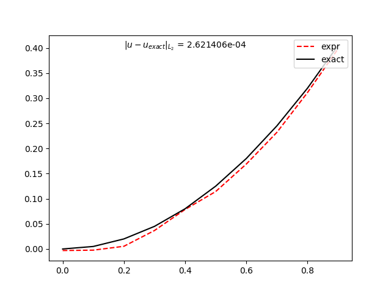
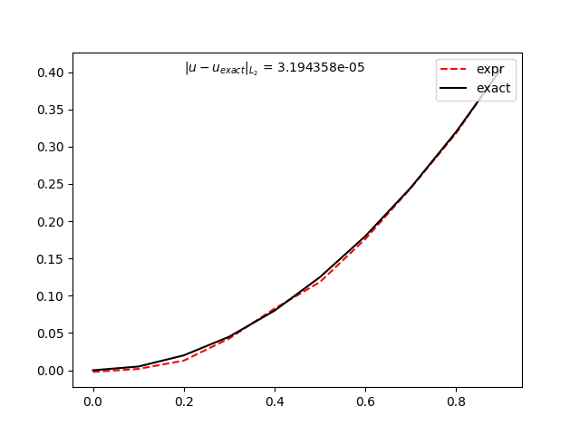
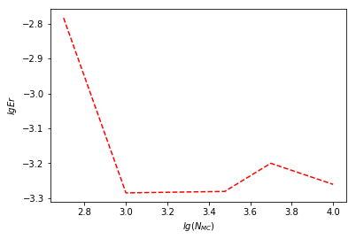
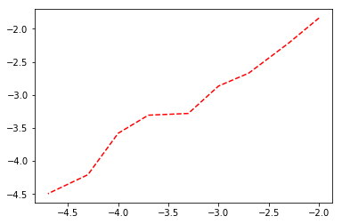

<h4 style="text-align:right">CCME,&nbsp; Peking University</h4>
***
<p>
<h1 style="text-align:center"><font face="Times Roman" size=6> Stochastic Partial Differential Equation: Exiting problem </font></h1>
<br>
<h2 style="text-align:center"><font face="Times Roman">Xin He, 1500011805 </font> </h2>

# Steps of solution of elliptic PDE by stochastic process  
**a reference can be found at [exit problem for PDE](https://math.nist.gov/mcsd/Seminars/2006/2006-10-18-mascagni-presentation.pdf)**  
the source code in github page [XShinHe/simple_SPDEs](https://github.com/XShinHe/simple_SPDEs)

for general elliptic PDE:  
$$
Lu(x) - c(x)u(x) = g(x),\quad x\in \Omega
\\
u(x) = f(x), \quad x\in \partial\Omega
$$
where the operator (Einstern summation convenstion)
$$
L = b_i\partial_i + \frac{1}{2}a_{ij}\partial_i\partial_j
\\
a_{ij} = \sigma_{ik}(\sigma^T)_{kj} = \sigma_{ik}\sigma_{jk}
$$
the wiener integral path gives:  
$$
u(x) = \mathbb{E}^L_x \big[ \int_0^{t_{\partial\Omega}} \{\frac{f(X^x(t_{\partial\Omega}))}{t_{\partial\Omega}} - g(X^x(t)) \}e^{-\int_0^t c(X^x(s))ds} dt \big]
$$  
with the stochastic path:  
$$
dX^x (t) = b(X^x,t) dt + \sigma(X^x, t) dW
\\
X^x(0) = x
$$

# The concrete example (HW7. Numerical SDE: Exit problem.)

for problem:  
$$
x\partial_x u + y\partial_y u + \frac{1}{2}\Delta u = x^2+y^2+1 \overset{def}{=} g(x,y)
\\
u(\partial \Omega) = 1/2 \overset{def}{=} f(x,y), \quad \partial\Omega : x^2+y^2=1
$$
the exact solution is 
$$
u(x,y) = \frac{1}{2}(x^2+y^2)
$$
so
$$
u(x,y) = \mathbb{E}_{x,y}^L [ f(X^{x,y}(t_{\partial\Omega})) - \int_0^{t_{\partial\Omega}}g(X)dt]
$$

so the stochastic of elliptic PDE needs:  
* from start point $(x,y)$ start, simulate process by (with Eular-Maruyama method) 
$$
dX_t = b X_t + dW_t, \quad X \overset{def}{=} (X_x, X_y), \quad b = (X_x, X_y)
\\
X_{n+1} - X_{n} = (X_{nx},X_{ny})^T X_n \delta t + \delta W_t
$$
* evaluate u(x,y) from 
$$
u(x,y) = \mathbb{E}_{x,y}^L [ f(X^{x,y}(t_{\partial\Omega})) - \int_0^{t_{\partial\Omega}}g(X)dt]
\\
= \mathbb{E}_{x,y}^L [ \frac{1}{2} - \int_0^{t_{\partial\Omega}} (X_{tx}^2+X_{ty}^2+1) dt]
$$
* repeat above until converge with error threshold.

But, note the implement of stochastic is only dependent the polar radius in $\Omega$, irrelative to the angle, so solution must to be ( **cylindrically symmetry** ), this symmetry can be used to reduce the calculation of stochastic process.

# Following gives the python version  
* python version is only an implement, and for faster calculation, the results actually are collected from fortran version, seeing my github project [simple_SPDEs](https://github.com/XShinHe/simple_SPDEs)


```python
import numpy as np

def check_if_exit(v):
    # Checks if v has intersected with the boundary of D = S(1)
    return (np.linalg.norm(v,2) >=1)

def em(x,dt):
    # b = (x,y), sigma = 1
    x += x * dt + np.random.normal(size=2,scale=np.sqrt(dt))

# nonhomogeneous term
g = lambda x : 1+x[0]*x[0]+x[1]*x[1]
# boundary term
f = lambda x : 0.5

def simulate_exit_time(v):
    # Simulates exit time starting at v=(x,y), returns exit position
    delta_t = 0.0001
    exit = False

    # Copy because simulation modifies in place
    if hasattr(v,'copy'): # For NumPy arrays
        x = v.copy() 
    else:
        x = np.array(v) # We input a non-NumPy array
    
    esti_val = 0
    while not check_if_exit(x):
        em(x, delta_t)
        esti_val -= g(x) * delta_t
    return esti_val + f(x)

v=np.array((0.5,0.5)) # The origin
print(v)

u = lambda x : 0.5*(x[0]**2+x[1]**2)

def get_exp_f_exit(starting_point, n_trials): 
    return np.mean([ simulate_exit_time(v) for k in range(0,n_trials)])

exp_f_exit = get_exp_f_exit(v,2000) # Expected value of f(Exit(x,d))
print('The value u(v) = %s\nThe value of Exp(f(Exit))=%s' %(u(v), exp_f_exit)) 
```

    [ 0.5  0.5]
    The value u(v) = 0.25
    The value of Exp(f(Exit))=0.233134289226


# Result analysis

## first we show calculations along the radius  
the simulation choose $dt=0.0001$ and $N_{MC}=3000$
  
the simulation choose $dt=0.00002$ and $N_{MC}=3000$
  
here the error defined as:  
$$
Err = \int_0^1 2\pi r dr |u_{expr}(r)-u_{exact}(r)|^2
$$

# the relation of error with $N_{MC}$  
here $dt=0.0005$, it show that $N_{MC}\ge 1000$ is enough to reach the limit of error.


```python
import numpy as np
import pandas as pd
import matplotlib.pyplot as plt
%matplotlib inline

# the dt=0.0005
a=pd.read_csv('collect2.dat',header=None,sep='\s+').values
logN = np.log10(a[:,0])

logerr = np.log10(a[:,1])
plt.plot(logN,logerr,'r--')
plt.xlabel(r'$lg(N_{MC})$')
plt.ylabel(r'$lg Er$')
plt.show()
```





# the relation of error with dt  
all $N_{MC} = 3000$, $dt=0.01,0.005, 0.002, 0.001, 0.0005, 0.0002, 0.0001, 0.00005, 0.00002$  
the result show that Eular-Maruyama is 1-order in weak convergence.


```python
import numpy as np
import pandas as pd
import matplotlib.pyplot as plt
import scipy.optimize as optimization

%matplotlib inline

a=pd.read_csv('collect.dat',header=None,sep='\s+').values
logdt = np.log10(a[:,0])
logerr = np.log10(a[:,1])

plt.plot(logdt,logerr,'r--')
plt.show()

def func(x, k, m):
    return k*x + m
sigma = np.zeros(len(logdt)) + 0.5
args = optimization.curve_fit(func, logdt, logerr , np.array([0.0,0.0]), sigma)[0]
print('the order is: %f '%(args[0]))
```





    the order is: 0.937673 

